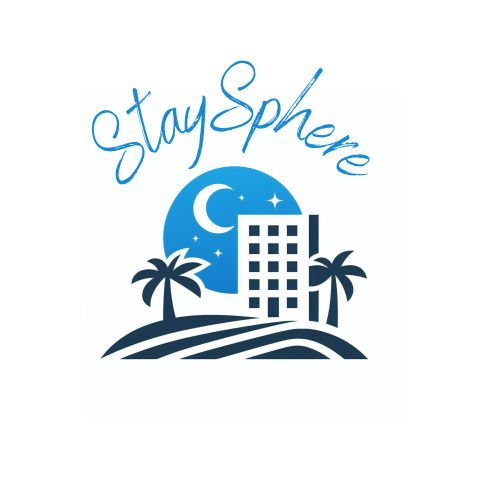

<a name="readme-top"></a>

<div align="center">
  
  <h1><b> StaySphere </b></h1>

</div>

<!-- TABLE OF CONTENTS -->

# 📗 Table of Contents

- [📗 Table of Contents](#-table-of-contents)
- [📖 StaySphere ](#-staysphere-)
  - [🛠 Built With ](#-built-with-)
    - [Tech Stack ](#tech-stack-)
    - [Key Features ](#key-features-)
  - [🚀 Live Demo ](#-live-demo-)
  - [💻 Getting Started ](#-getting-started-)
    - [Prerequisites](#prerequisites)
    - [Setup](#setup)
    - [Install](#install)
    - [Usage](#usage)
    - [Deployment](#deployment)
  - [👥 Authors ](#-authors-)
  - [🔭 Future Features ](#-future-features-)
  - [🤝 Contributing ](#-contributing-)
  - [⭐️ Show your support ](#️-show-your-support-)
  - [🙏 Acknowledgments ](#-acknowledgments-)
  - [📝 License ](#-license-)

<!-- PROJECT DESCRIPTION -->

# 📖 StaySphere <a name="about-project"></a>

**StaySphere** this app built with Rails and React on two different apps. This application enables users to signin/signup create hotels/AirBnb listings and create reservations on each hotel.

## 🛠 Built With <a name="built-with"></a>

- **Ruby on Rails**
- **React and Redux**

### Tech Stack <a name="tech-stack"></a>

- Ruby
- Rails
- Postgresql

<!-- Features -->

### Key Features <a name="key-features"></a>

- **[React Components]**
- **[Redux]**
- **[Database]**
- **[Rails API]**

<p align="right">(<a href="#readme-top">back to top</a>)</p>

<!-- LIVE DEMO -->

## 🚀 Live Demo <a name="live-demo"></a>

- Coming soon.

- [Link](https://github.com/tsheporamantso/final-capstone-rails-api) to Stay Sphere back-end repository

<p align="right">(<a href="#readme-top">back to top</a>)</p>

<!-- GETTING STARTED -->

## 💻 Getting Started <a name="getting-started"></a>

To get a local copy up and running, follow these steps.

### Prerequisites

In order to run this project you need:

- VScode
- Ruby
- Rails
- Postgres

### Setup

Clone this repository to your desired folder:

Make sure you setup and run the back-end first.

```sh
  git clone git@github.com:tsheporamantso/final-capstone-react-front-end.git
  cd final-capstone-react-front-end
```

### Install

Install this project with:

```sh
  npm install
```

```sh
  rails db:create
```

```sh
  rails db:migrate
  rails db:seed
```

### Usage

To run the project, execute the following command:

```sh
  npm start
```


### Deployment

Not deployed

<p align="right">(<a href="#readme-top">back to top</a>)</p>

<!-- AUTHORS -->

## 👥 Authors <a name="authors"></a>

👤 **Gladwin Tshepo Ramantso**

- GitHub: [@tsheporamantso](https://github.com/tsheporamantso)
- Twitter: [@ramgt001](https://twitter.com/ramgt001)
- LinkedIn: [Tshepo Gladwin Ramantso](https://www.linkedin.com/in/tshepo-ramantso-b6a35433/)

👤 **George Hamman**

- GitHub: [@githubhandle](https://github.com/George7h)
- LinkedIn: <a href="https://www.linkedin.com/in/george-hamman-95b98224b/">George Hamman</a>

👤 **Evans Kofi Nyamekye**
- GitHub: [evansnyamekye](https://github.com/evansnyamekye)
- Twitter: [@nyamekye2131](https://twitter.com/nyamekye2131)
- LinkedIn: [Evans Kofi Nyamekye](https://www.linkedin.com/in/evans-kofi-nyamekye-1980a4117/)

<p align="right">(<a href="#readme-top">back to top</a>)</p>

<!-- FUTURE FEATURES -->

## 🔭 Future Features <a name="future-features"></a>

- [ ] **Improve Styling**
- [ ] **Spesific room selection with each place**
- [ ] **Check to see if a person can book the hotel if they have rooms available**

<p align="right">(<a href="#readme-top">back to top</a>)</p>

<!-- CONTRIBUTING -->

## 🤝 Contributing <a name="contributing"></a>

Contributions, issues, and feature requests are welcome!

Feel free to check the [issues page](https://github.com/tsheporamantso/final-capstone-react-front-end/issues).

<p align="right">(<a href="#readme-top">back to top</a>)</p>

<!-- SUPPORT -->

## ⭐️ Show your support <a name="support"></a>

If you like this project feel free to leave a star and/or follow me on Github.

<p align="right">(<a href="#readme-top">back to top</a>)</p>

<!-- ACKNOWLEDGEMENTS -->

## 🙏 Acknowledgments <a name="acknowledgements"></a>

I would like to thank the code reviewers for taking the time to review our project and for Microverse for supplying it.
Also I would like to thank [Murat Korkmaz](https://www.behance.net/muratk) on Behance for the design inspiration.

<p align="right">(<a href="#readme-top">back to top</a>)</p>

<!-- LICENSE -->

## 📝 License <a name="license"></a>

This project is [MIT](./LICENSE) licensed.

<p align="right">(<a href="#readme-top">back to top</a>)</p>
